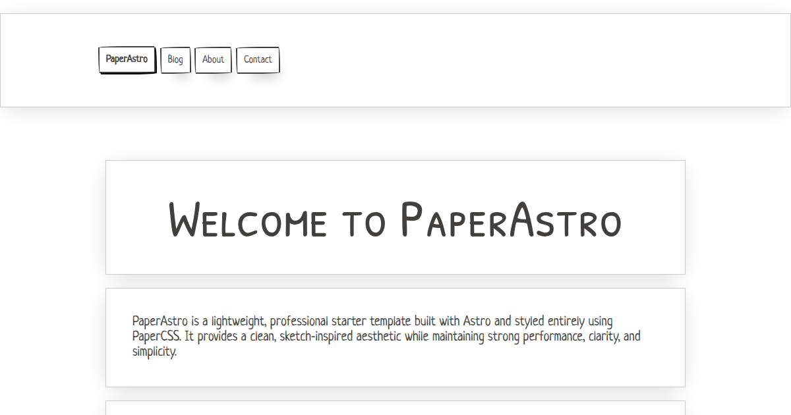

# PaperAstro

PaperAstro is a lightweight, professional Astro starter template styled with PaperCSS.  
It provides a clean, sketch‑inspired aesthetic while maintaining strong performance, clarity, and simplicity.

This template includes built‑in support for form handling through the Fabform form backend.  
Learn more at: https://fabform.io

## SCREENSHOT 

## DEMO

Live Demo: https://paperastro.vercel.app/

---

## Features

- Built with Astro 5
- Styled entirely with PaperCSS (no custom CSS required)
- MDX support included
- RSS and Sitemap integrations
- Sharp for image optimization
- Native form handling powered by the Fabform form backend
- Minimal, well‑structured project layout
- Suitable for blogs, documentation, and lightweight content sites

---

## Installation

Use the official Astro CLI:

    npm create astro@latest -- --template fabformhub/paperastro

Or clone the repository manually:

    git clone https://github.com/fabformhub/paperastro
    cd paperastro
    npm install
    npm run dev

---

## Project Structure

    /
    ├── public/
    ├── src/
    │   ├── components/
    │   ├── layouts/
    │   ├── pages/
    │   ├── consts.ts
    │   └── styles/
    └── package.json

---

## Commands

    npm run dev       # Start the development server
    npm run build     # Build the site for production
    npm run preview   # Preview the production build

---

## Form Handling with Fabform

PaperAstro includes ready‑to‑use form integration powered by the Fabform form backend.  
You can connect any form by adding your Fabform endpoint URL.

Learn more at: https://fabform.io

---

## Deploy with Vercel

You can deploy PaperAstro to Vercel with one click:

---

## License

MIT License  
© 2026 Geoffrey Callaghan

---

## Repository

GitHub: https://github.com/fabformhub/paperastro

